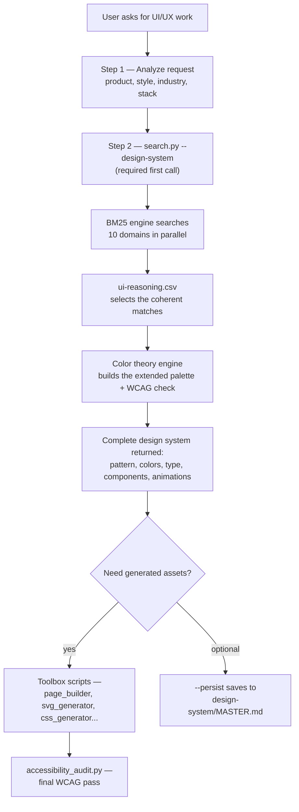

<div align="center">

[](https://github.com/CyebRageAnonymuos/ui-ux-cr)

[](https://github.com/CyebRageAnonymuos/ui-ux-cr/releases)
[](https://www.python.org/)
[](#the-toolbox)
[](https://github.com/CyebRageAnonymuos/ui-ux-cr/blob/main/LICENSE)
[](https://github.com/CyebRageAnonymuos/ui-ux-cr/stargazers)

**A design-intelligence skill that turns "build me a SaaS landing page" into a complete, reasoned design system — colors, type, components, animations, accessibility — in one terminal command.**

If this saves you a design pass, a ⭐ helps a lot.

</div>

<br/>

<div align="center">

<svg width="820" height="140" viewBox="0 0 820 140" xmlns="http://www.w3.org/2000/svg">
  <rect width="820" height="140" rx="14" fill="#0F172A"/>
  <defs>
    <linearGradient id="flowGrad" x1="0" y1="0" x2="1" y2="0">
      <stop offset="0%" stop-color="#F97316"/>
      <stop offset="100%" stop-color="#22D3EE"/>
    </linearGradient>
  </defs>
  <rect x="16" y="52" width="120" height="36" rx="18" fill="#1E293B" stroke="#F97316" stroke-opacity="0.7"/>
  <text x="76" y="75" text-anchor="middle" fill="#FDBA74" font-size="12" font-family="monospace">your query</text>
  <line x1="136" y1="70" x2="176" y2="70" stroke="url(#flowGrad)" stroke-width="2" stroke-dasharray="6 4">
    <animate attributeName="stroke-dashoffset" values="0;-20" dur="1s" repeatCount="indefinite"/>
  </line>
  <rect x="180" y="46" width="150" height="48" rx="10" fill="#1E293B" stroke="#22D3EE" stroke-opacity="0.7">
    <animate attributeName="stroke-opacity" values="0.3;0.9;0.3" dur="2.4s" repeatCount="indefinite"/>
  </rect>
  <text x="255" y="66" text-anchor="middle" fill="#67E8F9" font-size="11" font-weight="700">BM25 Engine</text>
  <text x="255" y="82" text-anchor="middle" fill="#94A3B8" font-size="9">n-gram · fuzzy · 120+ synonyms</text>
  <line x1="330" y1="70" x2="370" y2="70" stroke="url(#flowGrad)" stroke-width="2" stroke-dasharray="6 4">
    <animate attributeName="stroke-dashoffset" values="0;-20" dur="1s" repeatCount="indefinite"/>
  </line>
  <rect x="374" y="46" width="160" height="48" rx="10" fill="#1E293B" stroke="#F97316" stroke-opacity="0.7">
    <animate attributeName="stroke-opacity" values="0.9;0.3;0.9" dur="2.4s" repeatCount="indefinite"/>
  </rect>
  <text x="454" y="66" text-anchor="middle" fill="#FDBA74" font-size="11" font-weight="700">10 Domains</text>
  <text x="454" y="82" text-anchor="middle" fill="#94A3B8" font-size="9">searched in parallel</text>
  <line x1="534" y1="70" x2="574" y2="70" stroke="url(#flowGrad)" stroke-width="2" stroke-dasharray="6 4">
    <animate attributeName="stroke-dashoffset" values="0;-20" dur="1s" repeatCount="indefinite"/>
  </line>
  <rect x="578" y="46" width="150" height="48" rx="10" fill="#1E293B" stroke="#22D3EE" stroke-opacity="0.7">
    <animate attributeName="stroke-opacity" values="0.3;0.9;0.3" dur="2.4s" repeatCount="indefinite" begin="0.6s"/>
  </rect>
  <text x="653" y="66" text-anchor="middle" fill="#67E8F9" font-size="11" font-weight="700">Reasoning</text>
  <text x="653" y="82" text-anchor="middle" fill="#94A3B8" font-size="9">ui-reasoning.csv rules</text>
  <line x1="728" y1="70" x2="760" y2="70" stroke="url(#flowGrad)" stroke-width="2" stroke-dasharray="6 4">
    <animate attributeName="stroke-dashoffset" values="0;-20" dur="1s" repeatCount="indefinite"/>
  </line>
  <circle cx="784" cy="70" r="24" fill="#1E293B" stroke="url(#flowGrad)" stroke-width="2">
    <animate attributeName="r" values="22;26;22" dur="2s" repeatCount="indefinite"/>
  </circle>
  <text x="784" y="75" text-anchor="middle" font-size="16">🎨</text>
</svg>

</div>

<br/>

## Table of Contents

- [Overview](#overview)
- [Why Its Different](#why-its-different)
- [How It Works](#how-it-works)
- [Features](#features)
- [The Toolbox](#the-toolbox)
- [By the Numbers](#by-the-numbers)
- [Installation](#installation)
- [Usage](#usage)
- [Available Domains](#available-domains)
- [Available Stacks](#available-stacks)
- [Built-in Design Rules](#built-in-design-rules)
- [Pre-Delivery Checklist](#pre-delivery-checklist)
- [Worked Examples](#worked-examples)
- [Good to Know](#good-to-know)
- [Contributing](#contributing)
- [License](#license)

<br/>

## Overview

**UI UX CR** is a design-intelligence *skill* — a self-contained toolbox of Python scripts, backed by a hand-curated design database, meant to be dropped straight into an AI coding assistant's skill folder (Claude, opencode, or any agent that can shell out to Python). Point it at a request like *"healthcare SaaS dashboard"* and it doesn't hand back a vague suggestion — it runs an actual search-and-reasoning pipeline across ten design domains and returns a complete, justified design system: pattern, style, extended color palette, typography with real Google Fonts pairings, components with working HTML/Tailwind code, animations, responsive rules, anti-patterns to avoid, and a pre-delivery checklist.

On top of that sits a 17-script toolbox that turns any piece of that design system into a ready asset — a full HTML landing page, an SVG icon set, a CSS utility kit, a favicon, a WCAG accessibility report — all generated, not guessed.

<br/>

## Why It's Different

Most "design helper" tools are either a static mood board or a prompt wrapper around an LLM's memory of what a SaaS site looks like. This one is closer to a small search engine with opinions:

- 🔍 **It searches, it doesn't guess** — an enhanced BM25 ranking engine (n-gram phrase matching, Levenshtein fuzzy matching for typos, 120+ synonym groups) retrieves the closest real entries from the design database instead of freehand-generating one.
- 🧠 **It reasons before it answers** — a dedicated rules file (`ui-reasoning.csv`) decides which of the retrieved matches actually belong together, so the color palette, the typography, and the component set are chosen to be coherent, not just individually plausible.
- 💾 **It remembers per project** — the `--persist` flag writes a `design-system/MASTER.md` as the single source of truth, with a `design-system/pages/` folder for page-specific overrides, so a multi-page build stays visually consistent across sessions instead of re-rolling the palette every time.
- 🛠️ **It finishes the job** — the same database backs 17 generator scripts, so the system doesn't stop at a recommendation; it can hand you the actual HTML page, the SVG icons, and a WCAG audit of the result.

<br/>

## How It Works



This mirrors the exact workflow defined in the skill's own instructions (`SKILL.md`) for how an AI assistant should use it: analyze the request, always run `--design-system` first, optionally persist it, pull individual toolbox scripts for assets, then close with an accessibility audit before delivery.

<br/>

## Features

| Feature | Description |
|---|---|
| **Enhanced BM25 Search v2** | N-gram + Levenshtein fuzzy matching, 120+ synonym groups, category-based keyword boosting |
| **Design System Generator** | 10 domains searched in parallel, reconciled by a reasoning engine |
| **Color Theory Engine** | 50–900 shade palettes, 6 harmony types, HSL/HSV/CMYK conversion, WCAG AA/AAA contrast, color-blindness simulation (protanopia, deuteranopia, tritanopia) |
| **Component Library** | 30+ recommendations, 12 with auto-generated HTML/Tailwind code + ARIA guidance |
| **Animation Database** | 30+ patterns with full CSS, duration/easing/GPU notes, `prefers-reduced-motion` fallbacks |
| **Responsive Patterns** | 20+ patterns, mobile-first, breakpoints at 375 / 768 / 1024 / 1440px, RTL-ready |
| **Design Tokens** | 70+ categories as CSS variables and Tailwind config, light + dark values |
| **Accessibility Auditor** | Standalone WCAG audit — contrast, alt text, labels, heading order |
| **Master + Overrides Persistence** | `--persist` keeps one project-wide design source of truth with per-page overrides |

<br/>

## The Toolbox

17 standalone scripts — each one works alone, or feeds into `search.py`'s recommendations.

| # | Script | What it does |
|---|---|---|
| 01 | `search.py` | BM25 design search across 10 domains — the primary entry point |
| 02 | `svg_generator.py` | 70+ SVG icons, 6 background patterns, logo generation |
| 03 | `css_generator.py` | Shadows, gradients, glassmorphism, glow, neumorphism, full UI kit |
| 04 | `palette_generator.py` | Harmony palettes, shade scales, WCAG report |
| 05 | `typography_generator.py` | Modular type scales + font pairings from the database |
| 06 | `theme_exporter.py` | Exports a theme to CSS / Tailwind / SCSS / JSON |
| 07 | `component_generator.py` | 12 ready components (navbar, hero, pricing, modal, table, sidebar…) |
| 08 | `page_builder.py` | Composes a full HTML landing page from sections in one command |
| 09 | `layout_generator.py` | Grids, containers, spacing, breakpoints, 5 layout templates |
| 10 | `animation_generator.py` | 12 parameterized animations, or a full animation kit |
| 11 | `chart_generator.py` | Chart.js & Recharts configs across 8 chart types |
| 12 | `pattern_generator.py` | 12 CSS background patterns |
| 13 | `favicon_generator.py` | Favicon SVG, HTML head block, PWA manifest |
| 14 | `copy_generator.py` | Headlines, CTAs, placeholders, error copy, A/B variants |
| 15 | `mockup_generator.py` | ASCII wireframes — desktop, mobile, dashboard, login |
| 16 | `social_specs.py` | Dimension cheat sheets for 10 social platforms |
| 17 | `accessibility_audit.py` | WCAG audit of a finished HTML file |

**A realistic 60-second workflow:**

```bash
# 1. Build a full landing page for a Micro SaaS
python3 scripts/page_builder.py --product "Micro SaaS" --sections navbar,hero,features,pricing,cta,footer --out landing.html

# 2. Replace emoji placeholders with real SVG icons
python3 scripts/svg_generator.py --icon check --color "#10B981" --size 24

# 3. Add a complete animation kit
python3 scripts/animation_generator.py --kit

# 4. Audit the page for accessibility
python3 scripts/accessibility_audit.py landing.html
```

<br/>

## By the Numbers

<div align="center">

<svg width="820" height="290" viewBox="0 0 820 290" xmlns="http://www.w3.org/2000/svg">
  <rect width="820" height="290" rx="14" fill="#0F172A"/>
  <defs>
    <linearGradient id="barGrad2" x1="0" y1="0" x2="1" y2="0">
      <stop offset="0%" stop-color="#F97316"/>
      <stop offset="100%" stop-color="#22D3EE"/>
    </linearGradient>
  </defs>
  <text x="24" y="34" fill="#E2E8F0" font-size="15" font-weight="700">Data Coverage — v2.1</text>

  <text x="24" y="70" fill="#94A3B8" font-size="12">Product Types</text>
  <rect x="230" y="58" width="560" height="16" rx="8" fill="#1E293B"/>
  <rect x="230" y="58" width="327" height="16" rx="8" fill="url(#barGrad2)">
    <animate attributeName="width" values="0;327" dur="1.6s" begin="0.1s" fill="freeze"/>
  </rect>
  <text x="800" y="71" fill="#E2E8F0" font-size="12" font-weight="700" text-anchor="end">70+</text>

  <text x="24" y="102" fill="#94A3B8" font-size="12">Color Palettes</text>
  <rect x="230" y="90" width="560" height="16" rx="8" fill="#1E293B"/>
  <rect x="230" y="90" width="373" height="16" rx="8" fill="url(#barGrad2)">
    <animate attributeName="width" values="0;373" dur="1.6s" begin="0.3s" fill="freeze"/>
  </rect>
  <text x="800" y="103" fill="#E2E8F0" font-size="12" font-weight="700" text-anchor="end">80+</text>

  <text x="24" y="134" fill="#94A3B8" font-size="12">Font Pairings</text>
  <rect x="230" y="122" width="560" height="16" rx="8" fill="#1E293B"/>
  <rect x="230" y="122" width="350" height="16" rx="8" fill="url(#barGrad2)">
    <animate attributeName="width" values="0;350" dur="1.6s" begin="0.5s" fill="freeze"/>
  </rect>
  <text x="800" y="135" fill="#E2E8F0" font-size="12" font-weight="700" text-anchor="end">75+</text>

  <text x="24" y="166" fill="#94A3B8" font-size="12">UI Styles</text>
  <rect x="230" y="154" width="560" height="16" rx="8" fill="#1E293B"/>
  <rect x="230" y="154" width="215" height="16" rx="8" fill="url(#barGrad2)">
    <animate attributeName="width" values="0;215" dur="1.6s" begin="0.7s" fill="freeze"/>
  </rect>
  <text x="800" y="167" fill="#E2E8F0" font-size="12" font-weight="700" text-anchor="end">46+</text>

  <text x="24" y="198" fill="#94A3B8" font-size="12">Synonym Groups</text>
  <rect x="230" y="186" width="560" height="16" rx="8" fill="#1E293B"/>
  <rect x="230" y="186" width="560" height="16" rx="8" fill="url(#barGrad2)">
    <animate attributeName="width" values="0;560" dur="1.6s" begin="0.9s" fill="freeze"/>
  </rect>
  <text x="800" y="199" fill="#E2E8F0" font-size="12" font-weight="700" text-anchor="end">120+</text>

  <text x="24" y="230" fill="#94A3B8" font-size="12">Tech Stacks</text>
  <rect x="230" y="218" width="560" height="16" rx="8" fill="#1E293B"/>
  <rect x="230" y="218" width="75" height="16" rx="8" fill="url(#barGrad2)">
    <animate attributeName="width" values="0;75" dur="1.6s" begin="1.1s" fill="freeze"/>
  </rect>
  <text x="800" y="231" fill="#E2E8F0" font-size="12" font-weight="700" text-anchor="end">16</text>

  <text x="24" y="262" fill="#94A3B8" font-size="12">Toolbox Scripts</text>
  <rect x="230" y="250" width="560" height="16" rx="8" fill="#1E293B"/>
  <rect x="230" y="250" width="79" height="16" rx="8" fill="url(#barGrad2)">
    <animate attributeName="width" values="0;79" dur="1.6s" begin="1.3s" fill="freeze"/>
  </rect>
  <text x="800" y="263" fill="#E2E8F0" font-size="12" font-weight="700" text-anchor="end">17</text>
</svg>

</div>

| Category | v1.x | v2.0 | v2.1 |
|---|---|---|---|
| Product Types | 51 | 70+ | **70+** |
| UI Styles | 31 | 46+ | **46+** |
| Color Palettes | 61 | 80+ | **80+** |
| Font Pairings | 61 | 75+ | **75+** |
| Synonym Groups | 34 | 120+ | **120+** |
| Toolbox Scripts | ✗ | 9 | **17** |
| Components (generated) | — | — | **12** |
| Layout Templates | — | — | **5** |
| Chart Types | — | — | **8 + 2 frameworks** |
| Background Patterns | — | — | **12 CSS** |
| SVG Icons | — | — | **70+** |
| WCAG Audit | ✗ | — | **Built-in tool** |

<br/>

## Installation

**Option 1 — Direct copy**

```bash
git clone https://github.com/CyebRageAnonymuos/ui-ux-cr.git
cp -r ui-ux-cr /path/to/your/project/
```

**Option 2 — As an opencode / Claude skill**

```bash
mkdir -p .opencode/skills/ui-ux-cr
cp -r ui-ux-cr/scripts .opencode/skills/ui-ux-cr/
cp -r ui-ux-cr/data .opencode/skills/ui-ux-cr/
cp ui-ux-cr/SKILL.md .opencode/skills/ui-ux-cr/
```

**Prerequisites**

```bash
python3 --version
```

Not installed? `brew install python3` (macOS) · `sudo apt install python3` (Ubuntu) · `winget install Python.Python.3.12` (Windows)

<br/>

## Usage

**Generate a complete design system (primary feature):**

```bash
python3 scripts/search.py "SaaS landing page modern" --design-system -p "My SaaS"
```

Returns: pattern, style, colors + extended palette, typography with Google Fonts links, effects, components with code, animations with CSS, responsive patterns, anti-patterns, and a pre-delivery checklist.

**Persist it as the project's design source of truth:**

```bash
python3 scripts/search.py "ecommerce" --design-system --persist -p "MyShop"
```

**Full cross-domain analysis:**

```bash
python3 scripts/search.py "<query>" --analyze
```

**Advanced flags:**

```bash
python3 scripts/search.py "healthcare saas" --wcag              # WCAG contrast analysis
python3 scripts/search.py "fintech dashboard" --export-css      # CSS custom properties
python3 scripts/search.py "ecommerce luxury" --export-tailwind  # Tailwind config
python3 scripts/search.py "healthcare" --color-palette          # Extended color palette
python3 scripts/search.py "modern dark" --multi-domains style,color,typography
```

**Output formats:**

```bash
python3 scripts/search.py "fintech" --design-system               # ASCII, for the terminal
python3 scripts/search.py "fintech" --design-system -f markdown   # Markdown, for docs
python3 scripts/search.py "glassmorphism" --domain style --json   # JSON
```

<br/>

## Available Domains

| Domain | Use For | Example Keywords |
|---|---|---|
| `style` | UI styles, colors, effects | glassmorphism, minimalism, dark mode |
| `color` | Color palettes by product | saas, ecommerce, healthcare |
| `typography` | Font pairings | elegant, playful, professional |
| `landing` | Page structure, CTA strategy | hero, testimonial, pricing |
| `chart` | Chart types & libraries | trend, comparison, funnel |
| `ux` | Best practices, anti-patterns | animation, accessibility, loading |
| `component` | Component recommendations | button, card, modal, form |
| `animation` | Animation patterns | hover, entrance, scroll |
| `responsive` | Responsive patterns | mobile-first, grid |
| `design_token` | Design tokens | color, spacing, shadow |
| `product` | Product types | SaaS, e-commerce |
| `icons` | Icon recommendations | lucide, heroicons |
| `react` | React/Next.js performance | memo, suspense, bundle |
| `web` | Web interface guidelines | aria, focus, keyboard |

<br/>

## Available Stacks

`html-tailwind` (default) · `react` · `nextjs` · `vue` · `nuxtjs` · `svelte` · `swiftui` · `react-native` · `flutter` · `shadcn` · `jetpack-compose` · `angular` · `laravel` · `threejs` · `astro` · `nuxt-ui`

<br/>

## Built-in Design Rules

The skill doesn't just generate assets — it enforces a set of professional UI rules on every output. Pulled directly from its own guidelines:

**Icons & Visual Elements**

| Rule | Do | Don't |
|---|---|---|
| No emoji icons | Use SVG icons (Heroicons, Lucide, Simple Icons) | Use emojis as UI icons |
| Stable hover states | Use color/opacity transitions on hover | Use scale transforms that shift layout |
| Correct brand logos | Research the official SVG from Simple Icons | Guess or use incorrect logo paths |
| Consistent icon sizing | Fixed viewBox (24×24) with `w-6 h-6` | Mix different icon sizes randomly |

**Interaction & Cursor**

| Rule | Do | Don't |
|---|---|---|
| Cursor pointer | Add `cursor-pointer` to all clickable elements | Leave the default cursor on interactive elements |
| Hover feedback | Provide visual feedback (color, shadow, border) | Give no indication an element is interactive |
| Smooth transitions | Use `transition-colors duration-200` | Instant state changes, or anything over 500ms |

**Light / Dark Mode Contrast**

| Rule | Do | Don't |
|---|---|---|
| Glass card, light mode | Use `bg-white/80` or higher opacity | Use `bg-white/10` (too transparent) |
| Text contrast, light mode | Use `#0F172A` (slate-900) for text | Use `#94A3B8` (slate-400) for body text |
| Muted text, light mode | Use `#475569` (slate-600) minimum | Use gray-400 or lighter |
| Border visibility | Use `border-gray-200` in light mode | Use `border-white/10` (invisible) |

<br/>

## Pre-Delivery Checklist

- [ ] No emojis as icons — use `svg_generator.py`
- [ ] `cursor-pointer` on all clickable elements
- [ ] Hover states 150–300ms, no layout shift
- [ ] Contrast 4.5:1 minimum — verify with `accessibility_audit.py`
- [ ] All images have alt text
- [ ] Form inputs have labels
- [ ] `prefers-reduced-motion` respected
- [ ] Responsive at 375 / 768 / 1024 / 1440px
- [ ] Loading, error, and empty states designed
- [ ] Dark mode tested

<br/>

## Worked Examples

**SaaS landing page, end to end**

```bash
python3 scripts/search.py "SaaS landing page modern" --design-system -p "My SaaS"
python3 scripts/page_builder.py --product "SaaS (General)" --sections navbar,hero,features,pricing,cta,footer --out landing.html
python3 scripts/css_generator.py --ui-kit --primary #2563EB --cta #F97316
python3 scripts/svg_generator.py --icon check --size 24
```
*Recommended: Glassmorphism + Flat · Trust blue `#2563EB` + orange CTA `#F97316` · Poppins + Inter*

**Healthcare dashboard**

```bash
python3 scripts/search.py "healthcare dashboard" --design-system -p "Health App"
python3 scripts/layout_generator.py --layout dashboard
python3 scripts/chart_generator.py --chart line --labels "Mon,Tue,Wed,Thu,Fri" --data "120,180,150,220,190"
```
*Recommended: Dark Mode (OLED) · `#0F172A` background + health green `#22C55E` · Merriweather + Open Sans*

**E-commerce store**

```bash
python3 scripts/search.py "ecommerce luxury" --design-system -p "Luxury Shop"
python3 scripts/component_generator.py --component card --product "E-commerce"
python3 scripts/palette_generator.py "#1C1917" --harmony tetradic --check-wcag
```
*Recommended: Liquid Glass + Glassmorphism · Premium dark + gold `#CA8A04` · Cormorant Garamond + Montserrat*

<br/>

## Good to Know

- `SKILL.md` still headlines itself as **v2.0** ("Ultra-premium design intelligence system v2.0") and its own data-coverage table stops at 9 toolbox scripts, while `README.md` has moved on to **v2.1** and 17 scripts — the two docs haven't been updated in lockstep.
- The reasoning layer depends on a `ui-reasoning.csv` file shipped in `data/` — worth keeping in mind if you ever restructure the `data/` folder, since `search.py --design-system` reads it directly.

<br/>

## Contributing

1. Fork the repository
2. Create your branch: `git checkout -b feature/AmazingFeature`
3. Commit: `git commit -m 'Add some AmazingFeature'`
4. Push and open a Pull Request

<br/>

## License

MIT — see [LICENSE](https://github.com/CyebRageAnonymuos/ui-ux-cr/blob/main/LICENSE).

<br/>

<div align="center">

**[⬆ Back to top](#table-of-contents)**

Built with passion by Cyber-Rage — making AI-powered design accessible to everyone.

</div>


