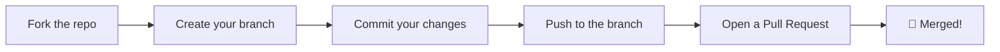

<!-- ═══════════════════════════════════════════════════════════════════════════
     ██████╗ ██╗   ██╗███████╗██████╗ ██████╗ ██╗████████╗
     ██╔══██╗██║   ██║██╔════╝██╔══██╗██╔══██╗██║╚══██╔══╝
     ██████╔╝██║   ██║█████╗  ██████╔╝██████╔╝██║   ██║
     ██╔══██╗██║   ██║██╔══╝  ██╔══██╗██╔══██╗██║   ██║
     ██████╔╝╚██████╔╝███████╗██████╔╝██║  ██║██║   ██║
     ╚═════╝  ╚═════╝ ╚══════╝╚═════╝ ╚═╝  ╚═╝╚═╝   ╚═╝
═══════════════════════════════════════════════════════════════════════════════ -->

<svg xmlns="http://www.w3.org/2000/svg" viewBox="0 0 1200 700" width="100%" style="display:block;margin:0;padding:0;">
  <defs>
    <!-- Cyberpunk Grid Pattern -->
    <pattern id="cyberGrid" x="0" y="0" width="40" height="40" patternUnits="userSpaceOnUse">
      <path d="M 40 0 L 0 0 0 40" fill="none" stroke="#22D3EE" stroke-width="0.3" stroke-opacity="0.3"/>
    </pattern>
    
    <!-- Animated gradient for title -->
    <linearGradient id="cyberGradient" x1="0%" y1="0%" x2="100%" y2="0%">
      <stop offset="0%" stop-color="#FF006E">
        <animate attributeName="stop-color" values="#FF006E;#22D3EE;#A78BFA;#FF006E" dur="4s" repeatCount="indefinite"/>
      </stop>
      <stop offset="33%" stop-color="#22D3EE">
        <animate attributeName="stop-color" values="#22D3EE;#A78BFA;#FF006E;#22D3EE" dur="4s" repeatCount="indefinite"/>
      </stop>
      <stop offset="66%" stop-color="#A78BFA">
        <animate attributeName="stop-color" values="#A78BFA;#FF006E;#22D3EE;#A78BFA" dur="4s" repeatCount="indefinite"/>
      </stop>
      <stop offset="100%" stop-color="#F97316">
        <animate attributeName="stop-color" values="#F97316;#22D3EE;#FF006E;#F97316" dur="4s" repeatCount="indefinite"/>
      </stop>
    </linearGradient>
    
    <!-- Neon glow filter -->
    <filter id="neonGlow" x="-50%" y="-50%" width="200%" height="200%">
      <feGaussianBlur stdDeviation="4" result="blur1"/>
      <feGaussianBlur stdDeviation="8" result="blur2"/>
      <feGaussianBlur stdDeviation="12" result="blur3"/>
      <feMerge>
        <feMergeNode in="blur3"/>
        <feMergeNode in="blur2"/>
        <feMergeNode in="blur1"/>
        <feMergeNode in="SourceGraphic"/>
      </feMerge>
    </filter>
    
    <!-- Scan line -->
    <linearGradient id="scanLine" x1="0%" y1="0%" x2="0%" y2="100%">
      <stop offset="0%" stop-color="#22D3EE" stop-opacity="0"/>
      <stop offset="50%" stop-color="#22D3EE" stop-opacity="0.4"/>
      <stop offset="100%" stop-color="#22D3EE" stop-opacity="0"/>
    </linearGradient>
    
    <!-- Radial glow -->
    <radialGradient id="pinkOrb" cx="50%" cy="50%" r="50%">
      <stop offset="0%" stop-color="#FF006E" stop-opacity="0.8"/>
      <stop offset="100%" stop-color="#FF006E" stop-opacity="0"/>
    </radialGradient>
    <radialGradient id="cyanOrb" cx="50%" cy="50%" r="50%">
      <stop offset="0%" stop-color="#22D3EE" stop-opacity="0.7"/>
      <stop offset="100%" stop-color="#22D3EE" stop-opacity="0"/>
    </radialGradient>
    <radialGradient id="purpleOrb" cx="50%" cy="50%" r="50%">
      <stop offset="0%" stop-color="#A78BFA" stop-opacity="0.7"/>
      <stop offset="100%" stop-color="#A78BFA" stop-opacity="0"/>
    </radialGradient>
  </defs>
  
  <!-- Background -->
  <rect width="1200" height="700" fill="#0A0A0F"/>
  
  <!-- Animated grid -->
  <rect width="1200" height="700" fill="url(#cyberGrid)">
    <animateTransform attributeName="transform" type="translate" values="0,0;-40,-40;0,0" dur="20s" repeatCount="indefinite"/>
  </rect>
  
  <!-- Floating orbs -->
  <circle r="120" fill="url(#pinkOrb)">
    <animate attributeName="cx" values="150;1100;150" dur="20s" repeatCount="indefinite"/>
    <animate attributeName="cy" values="200;500;200" dur="15s" repeatCount="indefinite"/>
    <animate attributeName="opacity" values="0.3;0.7;0.3" dur="4s" repeatCount="indefinite"/>
  </circle>
  <circle r="90" fill="url(#cyanOrb)">
    <animate attributeName="cx" values="1050;200;1050" dur="18s" repeatCount="indefinite"/>
    <animate attributeName="cy" values="500;150;500" dur="22s" repeatCount="indefinite"/>
    <animate attributeName="opacity" values="0.4;0.8;0.4" dur="5s" repeatCount="indefinite"/>
  </circle>
  <circle r="100" fill="url(#purpleOrb)">
    <animate attributeName="cx" values="600;300;900;600" dur="25s" repeatCount="indefinite"/>
    <animate attributeName="cy" values="350;600;100;350" dur="19s" repeatCount="indefinite"/>
    <animate attributeName="opacity" values="0.3;0.6;0.3" dur="6s" repeatCount="indefinite"/>
  </circle>
  
  <!-- Title with glitch -->
  <g filter="url(#neonGlow)">
    <text x="600" y="180" text-anchor="middle" font-family="Courier New, monospace" font-size="72" font-weight="900" fill="url(#cyberGradient)" letter-spacing="8">
      UI UX CR
      <animate attributeName="opacity" values="1;0.8;1;0.9;1" dur="3s" repeatCount="indefinite"/>
    </text>
    <!-- Glitch layer 1 -->
    <text x="597" y="180" text-anchor="middle" font-family="Courier New, monospace" font-size="72" font-weight="900" fill="#FF006E" letter-spacing="8" opacity="0">
      UI UX CR
      <animate attributeName="opacity" values="0;0;0.7;0;0;0;0;0.5;0" dur="4s" repeatCount="indefinite"/>
      <animateTransform attributeName="transform" type="translate" values="0,0;-3,0;3,0;0,0" dur="4s" repeatCount="indefinite"/>
    </text>
    <!-- Glitch layer 2 -->
    <text x="603" y="180" text-anchor="middle" font-family="Courier New, monospace" font-size="72" font-weight="900" fill="#22D3EE" letter-spacing="8" opacity="0">
      UI UX CR
      <animate attributeName="opacity" values="0;0.5;0;0;0;0.7;0;0" dur="4s" repeatCount="indefinite"/>
      <animateTransform attributeName="transform" type="translate" values="0,0;3,0;-3,0;0,0" dur="4s" repeatCount="indefinite"/>
    </text>
  </g>
  
  <!-- Subtitle -->
  <text x="600" y="240" text-anchor="middle" font-family="Courier New, monospace" font-size="20" fill="#22D3EE" letter-spacing="12" opacity="0.9">
    CYBER-RAGE DESIGN INTELLIGENCE ENGINE
    <animate attributeName="opacity" values="0.5;1;0.5" dur="3s" repeatCount="indefinite"/>
  </text>
  
  <!-- Terminal mockup -->
  <g>
    <rect x="300" y="290" width="600" height="200" rx="8" fill="#0F172A" stroke="#1E293B" stroke-width="2"/>
    <rect x="300" y="290" width="600" height="35" rx="8" fill="#1E293B"/>
    <circle cx="320" cy="308" r="6" fill="#EF4444"/>
    <circle cx="340" cy="308" r="6" fill="#F59E0B"/>
    <circle cx="360" cy="308" r="6" fill="#10B981"/>
    <text x="600" y="312" text-anchor="middle" font-family="Courier New, monospace" font-size="12" fill="#64748B">cyber-rage@design:~$</text>
    
    <!-- Command line with typing animation -->
    <text x="320" y="360" font-family="Courier New, monospace" font-size="14" fill="#22D3EE">$ python3 scripts/search.py</text>
    <text x="320" y="390" font-family="Courier New, monospace" font-size="14" fill="#F97316" textLength="560">  "SaaS landing page" --design-system
      <animate attributeName="textLength" values="0;560" dur="2s" repeatCount="1" begin="0.5s" fill="freeze"/>
    </text>
    
    <!-- Blinking cursor -->
    <rect x="320" y="420" width="10" height="18" fill="#22D3EE">
      <animate attributeName="opacity" values="1;0;1" dur="1s" repeatCount="indefinite"/>
    </rect>
  </g>
  
  <!-- Stats boxes -->
  <g>
    <rect x="150" y="540" width="200" height="100" rx="10" fill="#0F172A" stroke="#FF006E" stroke-width="2">
      <animate attributeName="stroke-opacity" values="0.4;1;0.4" dur="2.5s" repeatCount="indefinite"/>
    </rect>
    <text x="250" y="580" text-anchor="middle" font-family="Courier New, monospace" font-size="32" font-weight="900" fill="#FF006E">70+</text>
    <text x="250" y="610" text-anchor="middle" font-family="Courier New, monospace" font-size="13" fill="#94A3B8">PRODUCT TYPES</text>
    
    <rect x="380" y="540" width="200" height="100" rx="10" fill="#0F172A" stroke="#22D3EE" stroke-width="2">
      <animate attributeName="stroke-opacity" values="0.4;1;0.4" dur="2.8s" repeatCount="indefinite"/>
    </rect>
    <text x="480" y="580" text-anchor="middle" font-family="Courier New, monospace" font-size="32" font-weight="900" fill="#22D3EE">17</text>
    <text x="480" y="610" text-anchor="middle" font-family="Courier New, monospace" font-size="13" fill="#94A3B8">TOOLBOX SCRIPTS</text>
    
    <rect x="610" y="540" width="200" height="100" rx="10" fill="#0F172A" stroke="#A78BFA" stroke-width="2">
      <animate attributeName="stroke-opacity" values="0.4;1;0.4" dur="3s" repeatCount="indefinite"/>
    </rect>
    <text x="710" y="580" text-anchor="middle" font-family="Courier New, monospace" font-size="32" font-weight="900" fill="#A78BFA">120+</text>
    <text x="710" y="610" text-anchor="middle" font-family="Courier New, monospace" font-size="13" fill="#94A3B8">SYNONYMS</text>
    
    <rect x="840" y="540" width="200" height="100" rx="10" fill="#0F172A" stroke="#10B981" stroke-width="2">
      <animate attributeName="stroke-opacity" values="0.4;1;0.4" dur="2.6s" repeatCount="indefinite"/>
    </rect>
    <text x="940" y="580" text-anchor="middle" font-family="Courier New, monospace" font-size="32" font-weight="900" fill="#10B981">MIT</text>
    <text x="940" y="610" text-anchor="middle" font-family="Courier New, monospace" font-size="13" fill="#94A3B8">LICENSE</text>
  </g>
  
  <!-- Scan line effect -->
  <rect x="0" width="1200" height="40" fill="url(#scanLine)">
    <animate attributeName="y" values="-40;700;-40" dur="6s" repeatCount="indefinite"/>
  </rect>
</svg>

<div align="center">

<p align="center">
  
  
  
  
</p>

<p align="center">
  <a href="#-features">Features</a> •
  <a href="#-toolbox">Toolbox</a> •
  <a href="#-installation">Installation</a> •
  <a href="#-usage">Usage</a> •
  <a href="#-examples">Examples</a> •
  <a href="#-contributing">Contributing</a>
</p>

</div>

---

<div align="center">

### 🌐 Not just recommendations. **Generation.** 🌐

</div>

<div align="center">

> **UI UX CR** is an ultra-premium design intelligence system built for AI assistants and power users. It **generates** complete design systems, **builds** full HTML/Tailwind pages, **exports** production-ready themes, and **audits** accessibility — all from your terminal.

</div>

---

## ⚡ FEATURES

<svg xmlns="http://www.w3.org/2000/svg" viewBox="0 0 1200 150" width="100%">
  <defs>
    <linearGradient id="featureGrad" x1="0%" y1="0%" x2="100%" y2="0%">
      <stop offset="0%" stop-color="#FF006E"/>
      <stop offset="50%" stop-color="#22D3EE"/>
      <stop offset="100%" stop-color="#A78BFA"/>
    </linearGradient>
  </defs>
  <rect width="1200" height="150" fill="#0A0A0F" rx="10"/>
  <g font-family="Courier New, monospace">
    <text x="150" y="60" text-anchor="middle" font-size="36" fill="#FF006E">⚡</text>
    <text x="150" y="90" text-anchor="middle" font-size="14" fill="#94A3B8">ENHANCED</text>
    <text x="150" y="110" text-anchor="middle" font-size="14" fill="#94A3B8">BM25 SEARCH</text>
    
    <text x="350" y="60" text-anchor="middle" font-size="36" fill="#22D3EE">🎨</text>
    <text x="350" y="90" text-anchor="middle" font-size="14" fill="#94A3B8">COLOR THEORY</text>
    <text x="350" y="110" text-anchor="middle" font-size="14" fill="#94A3B8">ENGINE</text>
    
    <text x="550" y="60" text-anchor="middle" font-size="36" fill="#A78BFA">🧰</text>
    <text x="550" y="90" text-anchor="middle" font-size="14" fill="#94A3B8">17 TOOLBOX</text>
    <text x="550" y="110" text-anchor="middle" font-size="14" fill="#94A3B8">SCRIPTS</text>
    
    <text x="750" y="60" text-anchor="middle" font-size="36" fill="#F97316">🏗️</text>
    <text x="750" y="90" text-anchor="middle" font-size="14" fill="#94A3B8">PAGE</text>
    <text x="750" y="110" text-anchor="middle" font-size="14" fill="#94A3B8">BUILDER</text>
    
    <text x="950" y="60" text-anchor="middle" font-size="36" fill="#10B981">♿</text>
    <text x="950" y="90" text-anchor="middle" font-size="14" fill="#94A3B8">WCAG</text>
    <text x="950" y="110" text-anchor="middle" font-size="14" fill="#94A3B8">AUDITOR</text>
  </g>
</svg>

| Feature | What it actually does |
|---------|----------------------|
| **Enhanced BM25 Search** | Fuzzy matching + n-grams + 120+ synonym groups |
| **Design System Generator** | 10 domains searched in parallel with reasoning engine |
| **Color Theory Engine** | 6 harmony types · WCAG contrast · color-blind simulation |
| **17 Toolbox Scripts** | Icons, CSS kits, components, animations, charts, pages… |
| **Component Generator** | 12 production-ready components (navbar, hero, pricing…) |
| **Page Builder** | Full HTML landing page in a single command |
| **Accessibility Auditor** | Real WCAG checks: contrast, alt, labels, heading order |
| **Animation Database** | 30+ patterns + full kit with `prefers-reduced-motion` |
| **Design Tokens** | 70+ categories → CSS variables & Tailwind config |

---

## 🧰 THE TOOLBOX

<div align="center">

### 🛠️ 17 Standalone Scripts · 100% Python · Zero Dependencies

</div>

<svg xmlns="http://www.w3.org/2000/svg" viewBox="0 0 1200 500" width="100%">
  <defs>
    <filter id="toolGlow" x="-50%" y="-50%" width="200%" height="200%">
      <feGaussianBlur stdDeviation="2" result="blur"/>
      <feMerge>
        <feMergeNode in="blur"/>
        <feMergeNode in="SourceGraphic"/>
      </feMerge>
    </filter>
  </defs>
  
  <rect width="1200" height="500" fill="#0A0A0F" rx="10"/>
  
  <!-- Grid of tools -->
  <!-- Row 1 -->
  <g filter="url(#toolGlow)">
    <rect x="80" y="60" width="200" height="80" rx="8" fill="#0F172A" stroke="#FF006E" stroke-width="1.5">
      <animate attributeName="stroke-opacity" values="0.4;1;0.4" dur="3s" repeatCount="indefinite"/>
    </rect>
    <text x="180" y="95" text-anchor="middle" font-family="Courier New, monospace" font-size="14" fill="#FF006E">search.py</text>
    <text x="180" y="115" text-anchor="middle" font-family="Courier New, monospace" font-size="10" fill="#64748B">BM25 Design Search</text>
  </g>
  
  <g filter="url(#toolGlow)">
    <rect x="300" y="60" width="200" height="80" rx="8" fill="#0F172A" stroke="#22D3EE" stroke-width="1.5">
      <animate attributeName="stroke-opacity" values="0.4;1;0.4" dur="3.2s" repeatCount="indefinite"/>
    </rect>
    <text x="400" y="95" text-anchor="middle" font-family="Courier New, monospace" font-size="14" fill="#22D3EE">svg_generator.py</text>
    <text x="400" y="115" text-anchor="middle" font-family="Courier New, monospace" font-size="10" fill="#64748B">70+ SVG Icons</text>
  </g>
  
  <g filter="url(#toolGlow)">
    <rect x="520" y="60" width="200" height="80" rx="8" fill="#0F172A" stroke="#A78BFA" stroke-width="1.5">
      <animate attributeName="stroke-opacity" values="0.4;1;0.4" dur="3.4s" repeatCount="indefinite"/>
    </rect>
    <text x="620" y="95" text-anchor="middle" font-family="Courier New, monospace" font-size="14" fill="#A78BFA">css_generator.py</text>
    <text x="620" y="115" text-anchor="middle" font-family="Courier New, monospace" font-size="10" fill="#64748B">Shadows · Glass · Glow</text>
  </g>
  
  <g filter="url(#toolGlow)">
    <rect x="740" y="60" width="200" height="80" rx="8" fill="#0F172A" stroke="#F97316" stroke-width="1.5">
      <animate attributeName="stroke-opacity" values="0.4;1;0.4" dur="3.6s" repeatCount="indefinite"/>
    </rect>
    <text x="840" y="95" text-anchor="middle" font-family="Courier New, monospace" font-size="14" fill="#F97316">palette_gen.py</text>
    <text x="840" y="115" text-anchor="middle" font-family="Courier New, monospace" font-size="10" fill="#64748B">Color Harmony Engine</text>
  </g>
  
  <!-- Row 2 -->
  <g filter="url(#toolGlow)">
    <rect x="80" y="160" width="200" height="80" rx="8" fill="#0F172A" stroke="#10B981" stroke-width="1.5">
      <animate attributeName="stroke-opacity" values="0.4;1;0.4" dur="2.8s" repeatCount="indefinite"/>
    </rect>
    <text x="180" y="195" text-anchor="middle" font-family="Courier New, monospace" font-size="14" fill="#10B981">typography_gen.py</text>
    <text x="180" y="215" text-anchor="middle" font-family="Courier New, monospace" font-size="10" fill="#64748B">Modular Type Scales</text>
  </g>
  
  <g filter="url(#toolGlow)">
    <rect x="300" y="160" width="200" height="80" rx="8" fill="#0F172A" stroke="#F472B6" stroke-width="1.5">
      <animate attributeName="stroke-opacity" values="0.4;1;0.4" dur="3.1s" repeatCount="indefinite"/>
    </rect>
    <text x="400" y="195" text-anchor="middle" font-family="Courier New, monospace" font-size="14" fill="#F472B6">theme_exporter.py</text>
    <text x="400" y="215" text-anchor="middle" font-family="Courier New, monospace" font-size="10" fill="#64748B">CSS · Tailwind · SCSS</text>
  </g>
  
  <g filter="url(#toolGlow)">
    <rect x="520" y="160" width="200" height="80" rx="8" fill="#0F172A" stroke="#FCD34D" stroke-width="1.5">
      <animate attributeName="stroke-opacity" values="0.4;1;0.4" dur="3.3s" repeatCount="indefinite"/>
    </rect>
    <text x="620" y="195" text-anchor="middle" font-family="Courier New, monospace" font-size="14" fill="#FCD34D">component_gen.py</text>
    <text x="620" y="215" text-anchor="middle" font-family="Courier New, monospace" font-size="10" fill="#64748B">12 Production Components</text>
  </g>
  
  <g filter="url(#toolGlow)">
    <rect x="740" y="160" width="200" height="80" rx="8" fill="#0F172A" stroke="#60A5FA" stroke-width="1.5">
      <animate attributeName="stroke-opacity" values="0.4;1;0.4" dur="3.5s" repeatCount="indefinite"/>
    </rect>
    <text x="840" y="195" text-anchor="middle" font-family="Courier New, monospace" font-size="14" fill="#60A5FA">page_builder.py</text>
    <text x="840" y="215" text-anchor="middle" font-family="Courier New, monospace" font-size="10" fill="#64748B">Full HTML Landing Page</text>
  </g>
  
  <!-- Row 3 -->
  <g filter="url(#toolGlow)">
    <rect x="80" y="260" width="200" height="80" rx="8" fill="#0F172A" stroke="#C084FC" stroke-width="1.5">
      <animate attributeName="stroke-opacity" values="0.4;1;0.4" dur="2.9s" repeatCount="indefinite"/>
    </rect>
    <text x="180" y="295" text-anchor="middle" font-family="Courier New, monospace" font-size="14" fill="#C084FC">layout_gen.py</text>
    <text x="180" y="315" text-anchor="middle" font-family="Courier New, monospace" font-size="10" fill="#64748B">5 Layout Templates</text>
  </g>
  
  <g filter="url(#toolGlow)">
    <rect x="300" y="260" width="200" height="80" rx="8" fill="#0F172A" stroke="#34D399" stroke-width="1.5">
      <animate attributeName="stroke-opacity" values="0.4;1;0.4" dur="3.2s" repeatCount="indefinite"/>
    </rect>
    <text x="400" y="295" text-anchor="middle" font-family="Courier New, monospace" font-size="14" fill="#34D399">anim_gen.py</text>
    <text x="400" y="315" text-anchor="middle" font-family="Courier New, monospace" font-size="10" fill="#64748B">12 Animation Patterns</text>
  </g>
  
  <g filter="url(#toolGlow)">
    <rect x="520" y="260" width="200" height="80" rx="8" fill="#0F172A" stroke="#FB923C" stroke-width="1.5">
      <animate attributeName="stroke-opacity" values="0.4;1;0.4" dur="3.4s" repeatCount="indefinite"/>
    </rect>
    <text x="620" y="295" text-anchor="middle" font-family="Courier New, monospace" font-size="14" fill="#FB923C">chart_gen.py</text>
    <text x="620" y="315" text-anchor="middle" font-family="Courier New, monospace" font-size="10" fill="#64748B">Chart.js · Recharts</text>
  </g>
  
  <g filter="url(#toolGlow)">
    <rect x="740" y="260" width="200" height="80" rx="8" fill="#0F172A" stroke="#F43F5E" stroke-width="1.5">
      <animate attributeName="stroke-opacity" values="0.4;1;0.4" dur="3.6s" repeatCount="indefinite"/>
    </rect>
    <text x="840" y="295" text-anchor="middle" font-family="Courier New, monospace" font-size="14" fill="#F43F5E">pattern_gen.py</text>
    <text x="840" y="315" text-anchor="middle" font-family="Courier New, monospace" font-size="10" fill="#64748B">12 CSS Backgrounds</text>
  </g>
  
  <!-- Row 4 -->
  <g filter="url(#toolGlow)">
    <rect x="80" y="360" width="200" height="80" rx="8" fill="#0F172A" stroke="#A3E635" stroke-width="1.5">
      <animate attributeName="stroke-opacity" values="0.4;1;0.4" dur="3s" repeatCount="indefinite"/>
    </rect>
    <text x="180" y="395" text-anchor="middle" font-family="Courier New, monospace" font-size="14" fill="#A3E635">favicon_gen.py</text>
    <text x="180" y="415" text-anchor="middle" font-family="Courier New, monospace" font-size="10" fill="#64748B">SVG + PWA Manifest</text>
  </g>
  
  <g filter="url(#toolGlow)">
    <rect x="300" y="360" width="200" height="80" rx="8" fill="#0F172A" stroke="#FBBF24" stroke-width="1.5">
      <animate attributeName="stroke-opacity" values="0.4;1;0.4" dur="3.3s" repeatCount="indefinite"/>
    </rect>
    <text x="400" y="395" text-anchor="middle" font-family="Courier New, monospace" font-size="14" fill="#FBBF24">copy_gen.py</text>
    <text x="400" y="415" text-anchor="middle" font-family="Courier New, monospace" font-size="10" fill="#64748B">Headlines · CTAs · A/B</text>
  </g>
  
  <g filter="url(#toolGlow)">
    <rect x="520" y="360" width="200" height="80" rx="8" fill="#0F172A" stroke="#2DD4BF" stroke-width="1.5">
      <animate attributeName="stroke-opacity" values="0.4;1;0.4" dur="3.5s" repeatCount="indefinite"/>
    </rect>
    <text x="620" y="395" text-anchor="middle" font-family="Courier New, monospace" font-size="14" fill="#2DD4BF">a11y_audit.py</text>
    <text x="620" y="415" text-anchor="middle" font-family="Courier New, monospace" font-size="10" fill="#64748B">Real WCAG Checks</text>
  </g>
  
  <g filter="url(#toolGlow)">
    <rect x="740" y="360" width="200" height="80" rx="8" fill="#0F172A" stroke="#818CF8" stroke-width="1.5">
      <animate attributeName="stroke-opacity" values="0.4;1;0.4" dur="3.7s" repeatCount="indefinite"/>
    </rect>
    <text x="840" y="395" text-anchor="middle" font-family="Courier New, monospace" font-size="14" fill="#818CF8">mockup_gen.py</text>
    <text x="840" y="415" text-anchor="middle" font-family="Courier New, monospace" font-size="10" fill="#64748B">ASCII Wireframes</text>
  </g>
</svg>

### 📋 Complete Tool Reference

| # | Script | Purpose | Quick Example |
|---|--------|---------|---------------|
| 01 | `search.py` | BM25 design search across 10 domains | `python3 scripts/search.py "saas" --design-system` |
| 02 | `svg_generator.py` | 70+ SVG icons, patterns, logos | `python3 scripts/svg_generator.py --icon search --size 24` |
| 03 | `css_generator.py` | Shadows, gradients, glass, glow, neumorphism | `python3 scripts/css_generator.py --ui-kit --primary #2563EB` |
| 04 | `palette_generator.py` | Harmony palettes + shade scales + WCAG | `python3 scripts/palette_generator.py "#2563EB" --harmony triadic --check-wcag` |
| 05 | `typography_generator.py` | Modular type scales + font pairings | `python3 scripts/typography_generator.py --scale golden-ratio` |
| 06 | `theme_exporter.py` | Export → CSS / Tailwind / SCSS / JSON | `python3 scripts/theme_exporter.py "#2563EB" --format all` |
| 07 | `component_generator.py` | 12 ready components | `python3 scripts/component_generator.py --component navbar --product "SaaS"` |
| 08 | `page_builder.py` | Compose a full HTML landing page | `python3 scripts/page_builder.py --sections navbar,hero,features --out landing.html` |
| 09 | `layout_generator.py` | Grids, containers, 5 templates | `python3 scripts/layout_generator.py --layout dashboard` |
| 10 | `animation_generator.py` | 12 animations + full kit | `python3 scripts/animation_generator.py --type bounce --duration 0.6` |
| 11 | `chart_generator.py` | Chart.js & Recharts (8 types) | `python3 scripts/chart_generator.py --chart bar --labels "Q1,Q2" --data "25,40"` |
| 12 | `pattern_generator.py` | 12 CSS background patterns | `python3 scripts/pattern_generator.py checkerboard --color #2563EB` |
| 13 | `favicon_generator.py` | Favicon SVG + HTML head + PWA | `python3 scripts/favicon_generator.py --text CR --bg #2563EB` |
| 14 | `copy_generator.py` | Headlines, CTAs, A/B variants | `python3 scripts/copy_generator.py --headline saas --count 3` |
| 15 | `mockup_generator.py` | ASCII wireframes | `python3 scripts/mockup_generator.py --type dashboard` |
| 16 | `social_specs.py` | Social media dimensions | `python3 scripts/social_specs.py --platform instagram` |
| 17 | `accessibility_audit.py` | WCAG audit of HTML | `python3 scripts/accessibility_audit.py index.html` |

---

## 🚀 INSTALLATION

<svg xmlns="http://www.w3.org/2000/svg" viewBox="0 0 1200 250" width="100%">
  <defs>
    <linearGradient id="installGrad" x1="0%" y1="0%" x2="100%" y2="0%">
      <stop offset="0%" stop-color="#10B981"/>
      <stop offset="100%" stop-color="#22D3EE"/>
    </linearGradient>
  </defs>
  <rect width="1200" height="250" fill="#0A0A0F" rx="10"/>
  
  <g font-family="Courier New, monospace">
    <text x="60" y="60" font-size="16" fill="#10B981" font-weight="900">▌Option 1: Direct Use</text>
    
    <rect x="60" y="80" width="520" height="80" rx="6" fill="#0F172A" stroke="#1E293B" stroke-width="1"/>
    <text x="80" y="110" font-size="13" fill="#22D3EE">$ git clone https://github.com/CyebRageAnonymuos/ui-ux-cr.git</text>
    <text x="80" y="135" font-size="13" fill="#F97316">$ cd ui-ux-cr</text>
    
    <text x="640" y="60" font-size="16" fill="#A78BFA" font-weight="900">▌Option 2: As a Skill</text>
    
    <rect x="640" y="80" width="500" height="80" rx="6" fill="#0F172A" stroke="#1E293B" stroke-width="1"/>
    <text x="660" y="110" font-size="13" fill="#22D3EE">$ mkdir -p .opencode/skills/ui-ux-cr</text>
    <text x="660" y="135" font-size="13" fill="#F97316">$ cp -r ui-ux-cr/* .opencode/skills/ui-ux-cr/</text>
    
    <text x="60" y="210" font-size="14" fill="#64748B">Requires: Python 3.8+ · No additional dependencies · Zero-config</text>
  </g>
</svg>

### 📦 Prerequisites

```bash
python3 --version  # Should be 3.8+
```

Not installed?
- **macOS**: `brew install python3`
- **Ubuntu**: `sudo apt install python3`
- **Windows**: `winget install Python.Python.3.12`

---

## 💻 USAGE

### ⚡ Generate a Complete Design System (Core Feature)

```bash
python3 scripts/search.py "SaaS landing page modern" --design-system -p "My SaaS"
```

**You get:**
- ✨ Pattern & Style recommendations
- 🎨 Colors + extended palette with WCAG contrast
- 🔤 Typography (with Google Fonts links)
- 🎭 Effects (glassmorphism, neumorphism, etc.)
- 🧩 Components with ready-to-use code
- 💫 Animations with CSS snippets
- 📱 Responsive patterns
- ⚠️ Anti-patterns to avoid
- ✅ Pre-delivery checklist

### 🎯 Advanced Flags

```bash
# WCAG contrast analysis
python3 scripts/search.py "healthcare saas" --wcag

# Export CSS custom properties
python3 scripts/search.py "fintech dashboard" --export-css

# Export Tailwind config
python3 scripts/search.py "ecommerce luxury" --export-tailwind

# Extended color palette
python3 scripts/search.py "healthcare" --color-palette

# Multi-domain analysis
python3 scripts/search.py "modern dark" --multi-domains style,color,typography

# Persist design system for reuse
python3 scripts/search.py "ecommerce" --design-system --persist -p "MyShop"
```

### 📤 Output Formats

```bash
python3 scripts/search.py "fintech" --design-system              # ASCII (terminal)
python3 scripts/search.py "fintech" --design-system -f markdown  # Markdown docs
python3 scripts/search.py "glassmorphism" --domain style --json  # JSON
```

---

## 🗂 AVAILABLE DOMAINS & STACKS

### 🔍 Domains

| Domain | Use For | Example Keywords |
|--------|---------|------------------|
| `style` | UI styles, colors, effects | glassmorphism, minimalism, dark mode |
| `color` | Color palettes by product | saas, ecommerce, healthcare |
| `typography` | Font pairings | elegant, playful, professional |
| `landing` | Page structure, CTA strategy | hero, testimonial, pricing |
| `chart` | Chart types & libraries | trend, comparison, funnel |
| `ux` | Best practices, anti-patterns | animation, accessibility, loading |
| `component` | Component recommendations | button, card, modal, form |
| `animation` | Animation patterns | hover, entrance, scroll |
| `responsive` | Responsive patterns | mobile-first, grid |
| `design_token` | Design tokens | color, spacing, shadow |
| `product` | Product types | SaaS, e-commerce |
| `icons` | Icon recommendations | lucide, heroicons |
| `react` | React/Next.js performance | memo, suspense, bundle |
| `web` | Web interface guidelines | aria, focus, keyboard |

### 🛠 Stacks

<svg xmlns="http://www.w3.org/2000/svg" viewBox="0 0 1200 100" width="100%">
  <rect width="1200" height="100" fill="#0A0A0F" rx="10"/>
  <g font-family="Courier New, monospace">
    <!-- Animated marquee -->
    <g>
      <text y="60" font-size="16" fill="#22D3EE">html-tailwind</text>
      <text y="60" font-size="16" fill="#F97316" dx="180">react</text>
      <text y="60" font-size="16" fill="#A78BFA" dx="280">nextjs</text>
      <text y="60" font-size="16" fill="#10B981" dx="400">vue</text>
      <text y="60" font-size="16" fill="#FF006E" dx="490">nuxtjs</text>
      <text y="60" font-size="16" fill="#22D3EE" dx="610">svelte</text>
      <text y="60" font-size="16" fill="#F97316" dx="730">swiftui</text>
      <text y="60" font-size="16" fill="#A78BFA" dx="860">react-native</text>
      <text y="60" font-size="16" fill="#10B981" dx="1040">flutter</text>
    </g>
  </g>
</svg>

**Available:** `html-tailwind` · `react` · `nextjs` · `vue` · `nuxtjs` · `svelte` · `swiftui` · `react-native` · `flutter` · `shadcn` · `jetpack-compose` · `angular` · `laravel` · `threejs` · `astro` · `nuxt-ui`

---

## 🎯 EXAMPLES

### 📊 Example 1 — SaaS Landing Page (End-to-End)

```bash
# 1. Design system
python3 scripts/search.py "SaaS landing page modern" --design-system -p "My SaaS"

# 2. Full page
python3 scripts/page_builder.py --product "SaaS (General)" \
  --sections navbar,hero,features,pricing,cta,footer \
  --out landing.html

# 3. Custom CSS kit + icons
python3 scripts/css_generator.py --ui-kit --primary #2563EB --cta #F97316
python3 scripts/svg_generator.py --icon check --size 24

# 4. Accessibility audit
python3 scripts/accessibility_audit.py landing.html
```

**Recommended:** Glassmorphism + Flat · Trust blue `#2563EB` + orange CTA `#F97316` · Poppins + Inter

---

### 🏥 Example 2 — Healthcare Dashboard

```bash
python3 scripts/search.py "healthcare dashboard" --design-system -p "Health App"
python3 scripts/layout_generator.py --layout dashboard
python3 scripts/chart_generator.py --chart line \
  --labels "Mon,Tue,Wed,Thu,Fri" \
  --data "120,180,150,220,190"
```

**Recommended:** Dark Mode (OLED) · `#0F172A` bg + health green `#22C55E` · Merriweather + Open Sans

---

### 💎 Example 3 — Luxury E-commerce

```bash
python3 scripts/search.py "ecommerce luxury" --design-system -p "Luxury Shop"
python3 scripts/component_generator.py --component card --product "E-commerce"
python3 scripts/palette_generator.py "#1C1917" --harmony tetradic --check-wcag
```

**Recommended:** Liquid Glass + Glassmorphism · Premium dark + gold `#CA8A04` · Cormorant Garamond + Montserrat

---

## 📊 DATA COVERAGE

<svg xmlns="http://www.w3.org/2000/svg" viewBox="0 0 1200 400" width="100%">
  <defs>
    <linearGradient id="barGrad1" x1="0%" y1="0%" x2="100%" y2="0%">
      <stop offset="0%" stop-color="#FF006E"/>
      <stop offset="100%" stop-color="#F97316"/>
    </linearGradient>
    <linearGradient id="barGrad2" x1="0%" y1="0%" x2="100%" y2="0%">
      <stop offset="0%" stop-color="#22D3EE"/>
      <stop offset="100%" stop-color="#60A5FA"/>
    </linearGradient>
    <linearGradient id="barGrad3" x1="0%" y1="0%" x2="100%" y2="0%">
      <stop offset="0%" stop-color="#A78BFA"/>
      <stop offset="100%" stop-color="#C084FC"/>
    </linearGradient>
    <linearGradient id="barGrad4" x1="0%" y1="0%" x2="100%" y2="0%">
      <stop offset="0%" stop-color="#10B981"/>
      <stop offset="100%" stop-color="#34D399"/>
    </linearGradient>
    <linearGradient id="barGrad5" x1="0%" y1="0%" x2="100%" y2="0%">
      <stop offset="0%" stop-color="#FBBF24"/>
      <stop offset="100%" stop-color="#F59E0B"/>
    </linearGradient>
    <linearGradient id="barGrad6" x1="0%" y1="0%" x2="100%" y2="0%">
      <stop offset="0%" stop-color="#F43F5E"/>
      <stop offset="100%" stop-color="#E11D48"/>
    </linearGradient>
  </defs>
  
  <rect width="1200" height="400" fill="#0A0A0F" rx="10"/>
  
  <text x="600" y="40" text-anchor="middle" font-family="Courier New, monospace" font-size="22" font-weight="900" fill="#22D3EE" letter-spacing="4">DATA COVERAGE v2.1</text>
  
  <!-- Bar 1 -->
  <text x="100" y="100" font-family="Courier New, monospace" font-size="14" fill="#94A3B8">Product Types</text>
  <rect x="100" y="110" width="0" height="30" rx="6" fill="url(#barGrad1)">
    <animate attributeName="width" from="0" to="700" dur="1.5s" fill="freeze"/>
  </rect>
  <text x="820" y="130" font-family="Courier New, monospace" font-size="16" fill="#FF006E" font-weight="900">70+</text>
  
  <!-- Bar 2 -->
  <text x="100" y="170" font-family="Courier New, monospace" font-size="14" fill="#94A3B8">UI Styles</text>
  <rect x="100" y="180" width="0" height="30" rx="6" fill="url(#barGrad2)">
    <animate attributeName="width" from="0" to="460" dur="1.5s" fill="freeze"/>
  </rect>
  <text x="580" y="200" font-family="Courier New, monospace" font-size="16" fill="#22D3EE" font-weight="900">46+</text>
  
  <!-- Bar 3 -->
  <text x="100" y="240" font-family="Courier New, monospace" font-size="14" fill="#94A3B8">Color Palettes</text>
  <rect x="100" y="250" width="0" height="30" rx="6" fill="url(#barGrad3)">
    <animate attributeName="width" from="0" to="800" dur="1.5s" fill="freeze"/>
  </rect>
  <text x="920" y="270" font-family="Courier New, monospace" font-size="16" fill="#A78BFA" font-weight="900">80+</text>
  
  <!-- Bar 4 -->
  <text x="100" y="310" font-family="Courier New, monospace" font-size="14" fill="#94A3B8">Font Pairings</text>
  <rect x="100" y="320" width="0" height="30" rx="6" fill="url(#barGrad4)">
    <animate attributeName="width" from="0" to="750" dur="1.5s" fill="freeze"/>
  </rect>
  <text x="870" y="340" font-family="Courier New, monospace" font-size="16" fill="#10B981" font-weight="900">75+</text>
  
  <!-- Bar 5 -->
  <text x="100" y="380" font-family="Courier New, monospace" font-size="14" fill="#94A3B8">Synonym Groups</text>
  <rect x="100" y="390" width="0" height="30" rx="6" fill="url(#barGrad5)">
    <animate attributeName="width" from="0" to="1000" dur="1.5s" fill="freeze"/>
  </rect>
  <text x="1120" y="410" font-family="Courier New, monospace" font-size="16" fill="#FBBF24" font-weight="900">120+</text>
</svg>

| Category | v1.x | v2.0 | v2.1 |
|----------|------|------|------|
| Product Types | 51 | 70+ | **70+** |
| UI Styles | 31 | 46+ | **46+** |
| Color Palettes | 61 | 80+ | **80+** |
| Font Pairings | 61 | 75+ | **75+** |
| Synonym Groups | 34 | 120+ | **120+** |
| Toolbox Scripts | ✗ | 9 | **17** |
| Components | — | — | **12 generated** |
| Layout Templates | — | — | **5** |
| Chart Types | — | — | **8 + 2 frameworks** |
| Background Patterns | — | — | **12 CSS** |
| SVG Icons | — | — | **70+** |
| WCAG Audit | ✗ | — | **Built-in tool** |

---

## ✅ PRE-DELIVERY CHECKLIST

<div align="center">

### 🎯 Ship with Confidence

</div>

```markdown
- [ ] No emojis as icons — use `svg_generator.py`
- [ ] `cursor-pointer` on every clickable element
- [ ] Hover states 150–300 ms, zero layout shift
- [ ] Contrast ≥ 4.5:1 — verify with `accessibility_audit.py`
- [ ] All images have meaningful `alt` text
- [ ] Form inputs have associated labels
- [ ] `prefers-reduced-motion` is respected
- [ ] Tested at 375 / 768 / 1024 / 1440 px
- [ ] Loading, error, and empty states designed
- [ ] Dark mode tested
```

---

## 🤝 CONTRIBUTING

<div align="center">

### 💡 Join the Cyber-Rage Revolution

</div>



1. Fork the repository
2. Create your branch: `git checkout -b feature/AmazingFeature`
3. Commit: `git commit -m 'Add some AmazingFeature'`
4. Push and open a Pull Request

---

## 📄 LICENSE

<div align="center">

**MIT License** — See [LICENSE](LICENSE) for details.

</div>

---

<div align="center">

<svg xmlns="http://www.w3.org/2000/svg" viewBox="0 0 1200 200" width="100%">
  <defs>
    <linearGradient id="footerGrad" x1="0%" y1="0%" x2="100%" y2="0%">
      <stop offset="0%" stop-color="#FF006E">
        <animate attributeName="stop-color" values="#FF006E;#22D3EE;#A78BFA;#FF006E" dur="4s" repeatCount="indefinite"/>
      </stop>
      <stop offset="100%" stop-color="#F97316">
        <animate attributeName="stop-color" values="#F97316;#A78BFA;#22D3EE;#F97316" dur="4s" repeatCount="indefinite"/>
      </stop>
    </linearGradient>
    <filter id="footerGlow">
      <feGaussianBlur stdDeviation="3" result="blur"/>
      <feMerge>
        <feMergeNode in="blur"/>
        <feMergeNode in="SourceGraphic"/>
      </feMerge>
    </filter>
  </defs>
  
  <rect width="1200" height="200" fill="#0A0A0F" rx="10"/>
  
  <g filter="url(#footerGlow)">
    <text x="600" y="80" text-anchor="middle" font-family="Courier New, monospace" font-size="24" font-weight="900" fill="url(#footerGrad)" letter-spacing="6">
      BUILT WITH CYBER-RAGE ⚡
    </text>
  </g>
  
  <text x="600" y="120" text-anchor="middle" font-family="Courier New, monospace" font-size="14" fill="#64748B">
    Making AI-powered design accessible to everyone
  </text>
  
  <text x="600" y="160" text-anchor="middle" font-family="Courier New, monospace" font-size="13" fill="#94A3B8">
    GitHub: CyebRageAnonymuos/ui-ux-cr
  </text>
</svg>

<p align="center">
  <a href="https://github.com/CyebRageAnonymuos/ui-ux-cr">
    
  </a>
  <a href="https://github.com/CyebRageAnonymuos/ui-ux-cr">
    
  </a>
  <a href="https://github.com/CyebRageAnonymuos/ui-ux-cr/issues">
    
  </a>
</p>

<p align="center">
  
</p>

</div>

---

<div align="center">

### 🎮 **Ready to level up your design game?** 🎮

**Star ⭐ this repo and start building!**

```bash
git clone https://github.com/CyebRageAnonymuos/ui-ux-cr.git && cd ui-ux-cr
```

</div>